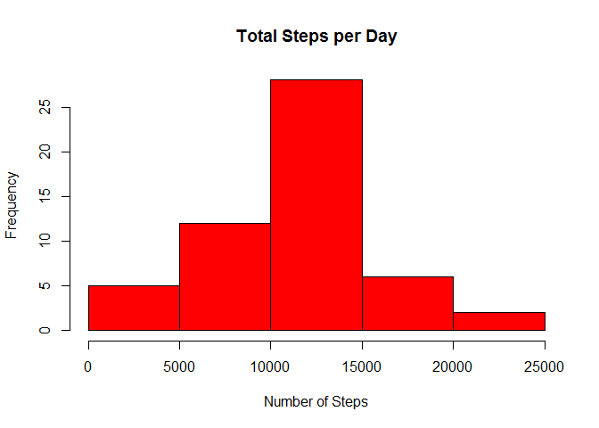
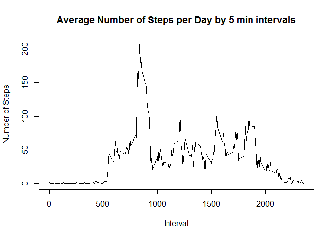
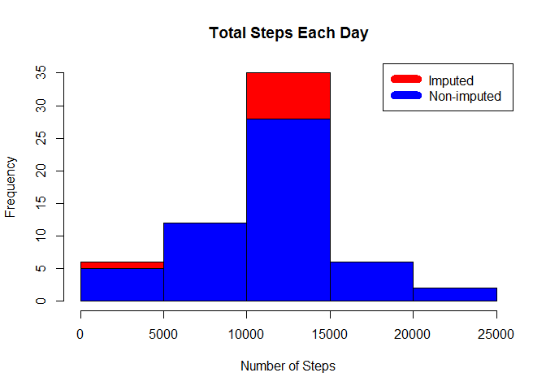
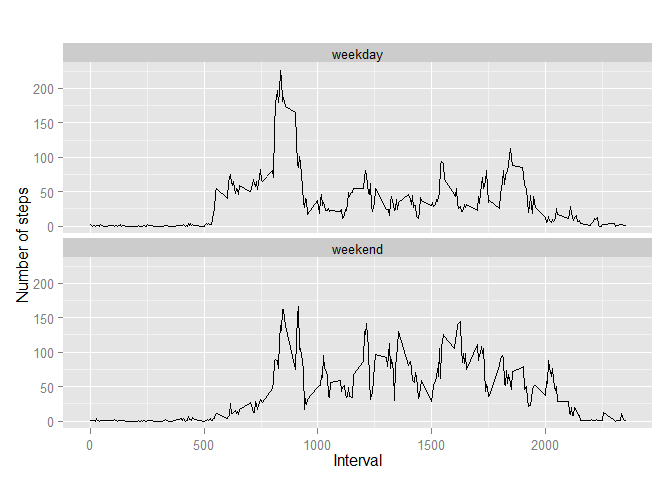

# Reproducible Research: Peer Assessment 1


## Loading and preprocessing the data


```r
if(!file.exists("activity.zip")) {
        temp <- tempfile()
        download.file("https://d396qusza40orc.cloudfront.net/repdata%2Fdata%2Factivity.zip",temp)
        unzip(temp)
        unlink(temp)
}

data <- read.csv("activity.csv")
```

## What is mean total number of steps taken per day?


```r
steps_day <- aggregate(steps ~ date, data, sum)
hist(steps_day$steps, main = paste("Total Steps per Day"), col="red", xlab="Number of Steps")
```

 


```r
rmean <- mean(steps_day$steps)
rmedian <- median(steps_day$steps)
```

The mean is 10766 steps, the median is 1765.


## What is the average daily activity pattern?


Time series plot (i.e. type = "l") of the 5-minute interval (x-axis) and the average number of steps taken, averaged across all days (y-axis)


```r
steps_interval <- aggregate(steps ~ interval, data, mean)

plot(steps_interval$interval,steps_interval$steps, type="l", xlab="Interval", ylab="Number of Steps",main="Average Number of Steps per Day by 5 min intervals")
```

 


```

The 5-minute interval, on average across all the days in the dataset, containing the maximum number of steps:


```r
max_interval <- steps_interval[which.max(steps_interval$steps),1]
```


## Imputing missing values

Calculating the number of missing data
Also creating a new dataset that is equal to the original dataset but with the missing data filled in.


```r
incomplete <- sum(!complete.cases(data))
imputed_data <- transform(data, steps = ifelse(is.na(data$steps), steps_interval$steps[match(data$interval, steps_interval$interval)], data$steps))
```


```r
imputed_data[as.character(imputed_data$date) == "2012-10-01", 1] <- 0
```

Recounting total steps by day and creating histogram.


```r
steps_day_i <- aggregate(steps ~ date, imputed_data, sum)
hist(steps_day_i$steps, main = paste("Total Steps Each Day"), col="red", xlab="Number of Steps")

#Create Histogram to show difference. 
hist(steps_day$steps, main = paste("Total Steps per Day"), col="blue", xlab="Number of Steps", add=T)
legend("topright", c("Imputed", "Non-imputed"), col=c("red", "blue"), lwd=10)
```

 

Calculating new mean and median for imputed data.


```r
rmean.i <- mean(steps_day_i$steps)
rmedian.i <- median(steps_day_i$steps)
```

Calculating difference between imputed and non-imputed data.


```r
mean_diff <- rmean.i - rmean
med_diff <- rmedian.i - rmedian
```
The imputed mean is 10589.7, the new median is 10766.2, the differences respectively -176.49 and 1.188. 


Calculating total difference.


```r
total_diff <- sum(steps_day_i$steps) - sum(steps_day$steps)
```
 The total difference is 75363.


## Are there differences in activity patterns between weekdays and weekends?

Creating a plot to compare and contrast number of steps between the week and weekend. 


```r
# convert date from string to Date class
imputed_data$date <- as.Date(imputed_data$date, "%Y-%m-%d")

# add a new column indicating day of the week 
imputed_data$day <- weekdays(imputed_data$date)

# add a new column called day type and initialize to weekday
imputed_data$day_type <- c("weekday")

# If day is Saturday or Sunday, make day_type as weekend
for (i in 1:nrow(imputed_data)){
  if (imputed_data$day[i] == "szombat" || imputed_data$day[i] == "vasárnap"){
    imputed_data$day_type[i] <- "weekend"
  }
}


# convert day_time from character to factor
imputed_data$day_type <- as.factor(imputed_data$day_type)

# aggregate steps as interval to get average number of steps in an interval across all days
table_interval_steps_imputed <- aggregate(steps ~ interval+day_type, imputed_data, mean)

# make the panel plot for weekdays and weekends
library(ggplot2)

qplot(interval, steps, data=table_interval_steps_imputed, geom=c("line"), xlab="Interval", 
      ylab="Number of steps", main="") + facet_wrap(~ day_type, ncol=1)
```

 


